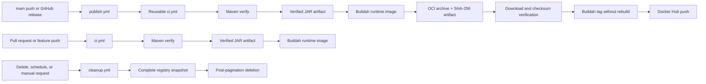

# CI/CD Operations and Governance

| Attribute | Value |
| --- | --- |
| Status | Active |
| Scope | GitHub Actions, Docker image publication, Docker Hub retention |
| Platform | GitHub-hosted Ubuntu runners and Docker Hub |
| Runtime baseline | Java 17, Maven, Docker, Buildah |
| Ownership | Repository maintainers |
| Review cadence | Review after workflow, registry, release, or credential-policy changes |

## 1. Purpose

This document defines the build, verification, publication, and retention controls for Tessera-DFE. The pipeline is designed around three invariants:

1. Pull requests and development branches never receive Docker Hub credentials.
2. The image published to Docker Hub is the exact image produced by the successful CI build; the publish stage does not rebuild it.
3. Registry cleanup completes a stable inventory before it performs any destructive operation.

## 2. Workflow architecture

### Workflow inventory

| Workflow | Responsibility | Registry write access |
| --- | --- | --- |
| `.github/workflows/ci.yml` | Maven verification and Buildah image build | No |
| `.github/workflows/publish.yml` | CI orchestration, artifact verification, tagging, publication | Yes |
| `.github/workflows/cleanup.yml` | Deleted-branch cleanup and scheduled retention | Yes |

Supporting scripts are stored under `.github/scripts`. Tag normalization must always use `normalize-docker-tag.sh`; Docker Hub authentication must always use `dockerhub-token.sh`.

### Dockerfile roles

| File | Intended use | Compilation behavior |
| --- | --- | --- |
| `Dockerfile` | Local and Docker Compose development builds | Self-contained Maven compilation inside the build stage |
| `Dockerfile.ci` | CI and release image assembly | Runtime-only; copies the JAR already produced and verified by Maven CI |

`Dockerfile.ci` must never invoke Maven or compile Java sources. The default `Dockerfile` preserves the ability to build directly from a source checkout without first installing Maven on the host.

## 3. Trigger and control matrix

| Event | CI | Publish | Cleanup |
| --- | --- | --- | --- |
| Pull request | Maven verify and Buildah image build | Never | No |
| Push to non-main branch | Maven verify and Buildah image build | Never | No |
| Push to `main` | Called by publish workflow | `main`, `latest`, full SHA | No |
| Published GitHub release | Called by publish workflow | Release tag, POM version, full SHA | No |
| Deleted Git branch | No | No | Delete normalized branch tag |
| Daily schedule | No | No | Feature cleanup followed by SHA cleanup |
| Manual CI dispatch | Maven verify and Buildah image build | No | No |
| Manual publish dispatch | Required CI, then publish only from `main` | `main`, `latest`, full SHA | No |
| Manual cleanup dispatch | No | No | Supports `dry_run` |

## 4. Verified artifact chain

For a main or release publication, `publish.yml` invokes `ci.yml` with `export_image=true`.

The CI jobs perform the following sequence:

1. Run the complete Maven verification lifecycle exactly once.
2. Render the Surefire and Failsafe JUnit XML results into the GitHub Actions job summary and a standalone HTML report.
3. Upload the HTML and source XML as the `test-report` artifact with 14-day retention, including when tests fail.
4. Select exactly one `jar-with-dependencies` output and stage it as `app.jar`.
5. Generate `app.jar.sha256` and upload the verified JAR as the immutable `tessera-application` workflow artifact.
6. Download and verify that JAR in the Buildah job.
7. Build `localhost/tessera-data-flow-engine:ci` from `Dockerfile.ci`; the Dockerfile only assembles the runtime filesystem and does not compile the application.
8. Export the image as an OCI archive using `buildah push` with the `oci-archive` transport.
9. Generate `tessera-container-image.tar.sha256`.
10. Upload the archive and checksum as the immutable `tessera-container-image` workflow artifact.

### Pull request presentation

Every pull request exposes two independent status checks:

- `test` — Maven verification, application artifact, and the test report;
- `build` — assembly of the runtime image from the verified JAR using Buildah.

The compact test result is displayed on the workflow run Summary page. The complete self-contained HTML report and the original JUnit XML files are downloadable from the `test-report` artifact. The workflow deliberately does not deploy reports to GitHub Pages and does not post persistent PR comments: both approaches add permissions, lifecycle management, and noise without improving the required-check signal.

Configure the stable `test` and `build` names as required status checks in the `main` branch ruleset. These names are an external contract and must not be changed without updating the ruleset in the same rollout. A pull request must not be mergeable while either check is missing, failing, or pending.

The publish job then:

1. Downloads the artifact from the same workflow run.
2. Verifies the archive with `sha256sum --check`.
3. Imports the archive through the Buildah `oci-archive` transport.
4. Validates that Buildah can inspect the imported image.
5. Adds the required Docker Hub tags without rebuilding.
6. Pushes each tag to Docker Hub.

Both handoff artifacts are retained for one day. They are internal workflow objects, not a distribution channel or long-term backup.

## 5. Image tag policy

| Tag | Source | Mutability |
| --- | --- | --- |
| `sha-<40-character-sha>` | Main or release commit | Immutable by policy |
| `main` | Latest successfully published main commit | Mutable |
| `latest` | Same image as `main` | Mutable |
| `<release-tag>` | Published GitHub release | Immutable by policy |
| `<pom-version>` | Release whose tag is `v<version>` or `<version>` | Immutable by policy |

A release is rejected when its Git tag, after removal of an optional leading `v`, does not exactly equal the project version in `pom.xml`.

Docker tag generation from Git refs is centralized. Invalid characters are replaced, invalid leading characters are removed, and values longer than 128 characters are deterministically shortened with a hash suffix.

## 6. Concurrency and ordering

All publication and cleanup runs share the repository-wide `dockerhub-mutation` concurrency group. Runs are not canceled while executing. This prevents older and newer publications from writing mutable tags concurrently, prevents a newer failing CI run from interrupting a valid in-progress publication, and prevents publication from changing registry pagination while cleanup is taking its inventory.

Within a scheduled cleanup run, feature cleanup completes before SHA cleanup starts. Registry enumeration therefore cannot overlap another workflow-managed registry mutation. This invariant assumes that operators and external systems do not mutate the Docker Hub repository outside these workflows during cleanup.

## 7. Cleanup safety model

Cleanup follows a collect-then-delete transaction pattern:

1. Resolve the active Git state.
2. Retrieve every Docker Hub result page without deleting anything.
3. Materialize and deduplicate candidate tags in a runner-temporary file.
4. Report the candidate count.
5. Apply `dry_run` or delete the materialized candidates.

This ordering prevents offset-based Docker Hub pagination from skipping records after earlier records are deleted.

Feature tags are retained when their normalized value matches an active repository branch. SHA tags are retained when their commit is reachable from a branch, Git tag, or an open pull request head/merge ref. Only open pull request refs are fetched; closed pull requests do not retain images indefinitely.

### Dry-run requirement

Run cleanup manually with `dry_run=true` after any change to:

- tag normalization;
- branch naming conventions;
- Docker Hub repository or namespace;
- pagination logic;
- reachability rules;
- GitHub API permissions.

Review the complete candidate list before allowing the next destructive run.

## 8. Credentials and permissions

Required repository secrets:

| Secret | Used by | Required capability |
| --- | --- | --- |
| `DOCKERHUB_USERNAME` | Publish and cleanup | Docker Hub account identifier |
| `DOCKERHUB_TOKEN` | Publish and cleanup | Push and tag-delete access only to the target repository |

CI jobs do not reference these secrets. Workflow-level GitHub token permissions are read-only. Cleanup additionally requests `pull-requests: read` to enumerate open pull requests.

Recommended repository configuration:

- Store Docker Hub secrets in a protected GitHub Environment.
- Restrict the environment to `main` and release tags.
- Require approval for production releases when the repository policy requires separation of duties.
- Rotate the Docker Hub token on a defined schedule and immediately after suspected disclosure.

Never print login responses, tokens, authorization headers, or generated Docker Hub JWTs.

## 9. Required repository controls

Configure the `main` ruleset with:

- pull requests required before merge;
- required Maven verification and Buildah image build checks;
- required approval and conversation resolution;
- branch update required before merge where operationally acceptable;
- force-push and branch deletion disabled;
- workflow-file changes subject to CODEOWNERS review when a platform owner is available.

## 10. Operating procedures

### Publish from main

Merge through the protected main branch. The publish workflow performs CI, exports the verified image, verifies the handoff checksum, and updates `main`, `latest`, and the full SHA tag.

### Publish a release

1. Set the final non-SNAPSHOT version in `pom.xml`.
2. Merge and verify the main publication.
3. Create a Git tag equal to the POM version, optionally prefixed with `v`.
4. Publish the GitHub release.
5. Confirm that the release, POM-version, and SHA tags resolve to the same Docker image.

### Validate cleanup

1. Open **Actions → Docker Hub Cleanup → Run workflow**.
2. Select `dry_run=true`.
3. Review feature and SHA candidate lists.
4. Resolve unexpected candidates before running with deletion enabled.

### Recover a mutable tag

Re-run the successful publish workflow for the desired main commit while its artifact is retained. If the artifact has expired, rebuild through the normal publish workflow from the authoritative Git ref. Do not manually construct an image under an existing SHA tag.

### Investigate a failed artifact handoff

Check, in order:

1. Maven verification produced exactly one `jar-with-dependencies` file.
2. The `tessera-application` artifact passed its SHA-256 verification in the Buildah job.
3. The CI Buildah image build completed successfully using `Dockerfile.ci`.
4. The artifact upload step produced `tessera-container-image`.
5. The download step ran in the same workflow run.
6. The SHA-256 file and OCI archive were downloaded into the same directory.
7. The Buildah container supports the `oci-archive` transport.

Do not bypass a checksum failure. Re-run CI to create a new artifact.

## 11. Change-management checklist

Every CI/CD change should include:

- YAML and embedded Bash syntax validation;
- a successful CI run from a non-main branch;
- review of secret and token permissions;
- validation that PR jobs cannot reach registry credentials;
- a cleanup dry-run when retention logic changes;
- confirmation that `Dockerfile.ci` contains no Maven or Java compilation step;
- confirmation that publish contains no Buildah build command;
- corresponding updates to this document and the README tag policy.

## 12. Platform compatibility

The current artifact handoff uses the GitHub.com artifact service and current GitHub-hosted runners. GitHub Enterprise Server installations may require different `upload-artifact` and `download-artifact` major versions and compatible self-hosted runner versions. Validate artifact-action and Node runtime compatibility before porting this workflow to GHES.
